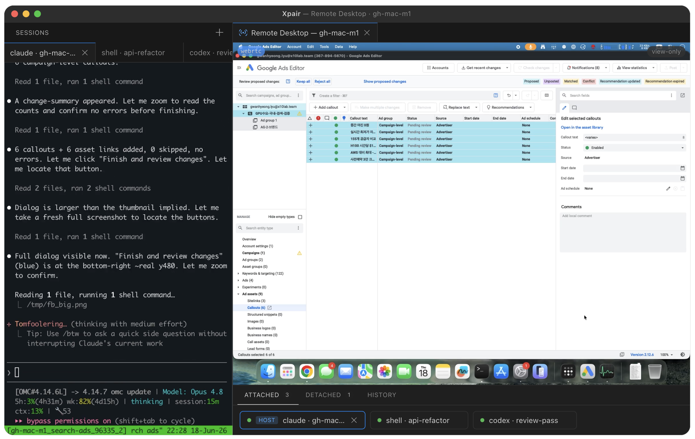
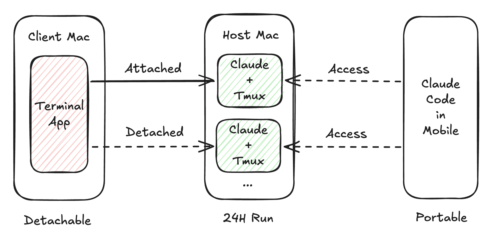
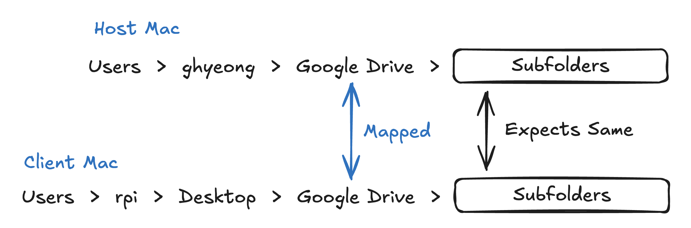
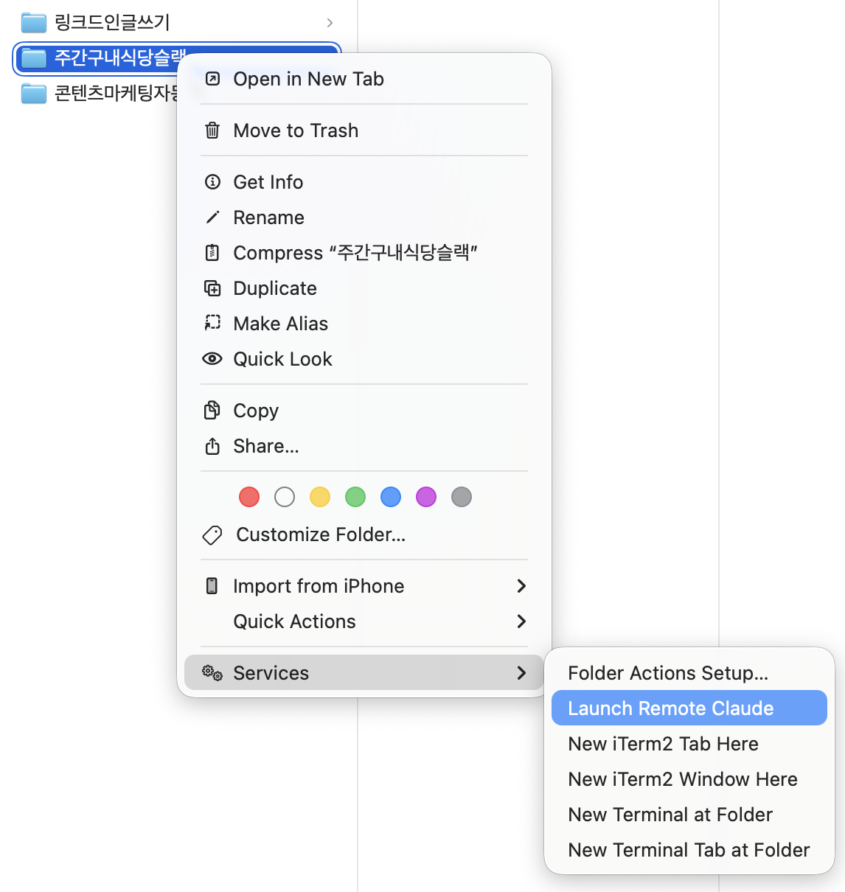

<p align="center">
  
</p>

<h1 align="center">Xpair</h1>

<p align="center"><a href="README.md">English</a> · <b>한국어</b></p>

이미 구독 중인 에이전트 — **Claude**, **Codex**, 또는 **OpenCode** — 를 항상 켜져 있는 Mac에서, macOS **Computer Use**(스크린샷·클릭·타이핑)를 살린 채로 돌리고, 노트북이나 폰에서 mosh/SSH로 붙는 도구입니다. 자리를 비워도 작업은 계속되고, 내 구독을 그대로 쓰므로 추가 AI 크레딧은 없습니다.

<p align="center">
  
</p>

- **호스트 Mac** — 에이전트를 영속 tmux 세션 안에서, Computer Use가 살아 있는 채로 24/7 돌립니다.
- **클라이언트** — Xpair IDE(VSCodium 포크) 또는 `xpair` CLI; Finder 우클릭으로 붙습니다.
- **모바일** — 폰의 Claude Code를 포함한 모든 SSH/mosh 클라이언트에서 같은 세션에 들어갑니다.

---

## 빠른 시작 — Claude Code에게 설치 맡기기

이미 Claude Code가 있다면? **설정하려는 Mac에서** 세션을 열고 아래 블록을 붙여넣으면 — 역할 판단, 설치, SSH 연결, 유일한 수동 권한 단계 안내까지 전 과정을 알아서 진행합니다.

```text
Set up Xpair (https://github.com/x10lab/xpair) on this Mac. Fetch and read its README, then follow it. Figure out whether this Mac is the host or the client, explain each command before you run it, and stop for anything that needs my input or my physical screen (like the one-time permission grant). Finish with xpair doctor and a summary of what's left for me to do.
```

직접 하고 싶다면? 아래 [설치](#설치)를 참고하세요. 어느 쪽이든 첫 실행 시 나머지를 안내하는 **온보딩** 흐름(아래)으로 들어갑니다.

---

## 기능



### 원격으로 가도 살아남는 Computer Use
에이전트를 SSH로 띄우면 macOS가 손쉬운 사용(AX)·화면 기록(SR) 권한을 떼어버려 스크린샷·클릭·타이핑이 조용히 멈춥니다. 권한을 쥔 메뉴바 앱(`XpairHost.app`)이 그 권한을 소유하고 에이전트를 자기 프로세스 하위 트리 안에 두기 때문에, 어떤 클라이언트가 붙어 있든 Computer Use가 계속 작동합니다.

### 연결이 끊겨도 살아남는 세션
노트북을 닫거나 Wi-Fi가 끊기면 보통 에이전트 세션은 연결과 함께 죽습니다. 패치된 tmux(`tmux-aqua`)가 모든 세션을 호스트에 살려둡니다 — 붙어 있으면 `Attached`, 떠나 있으면 `Detached`, 어느 쪽이든 24/7 돌아갑니다.

### 엔진 선택
가진 구독을 그대로 가져오세요: `claude`(고유의 `--remote-control` 사용), `codex`, 또는 `opencode`. 에이전트는 호스트에서 돌기 때문에 호스트에 설치돼 있어야 합니다. `xpair config set engine <claude|codex|opencode>`로 바꾸거나, `xpair launch --engine <e>`로 실행마다 덮어쓰세요.

### 막기만 하지 않고 해결하는 온보딩
첫 실행 시 안내형 설정이 열리고, 각 단계는 막다른 골목 대신 **스스로 고치는 hard-gate**입니다: CLI를 깔고, 엔진을 `brew install`하고, API 키를 설정하고, SSH 키 인증을 검증합니다. 비밀값은 argv·디스크가 아닌 stdin으로 전달됩니다.

### 노트북에서도 폰에서도 붙기
클라이언트 Mac(Finder → 우클릭 → *Launch Remote Pair*), Xpair IDE의 Sessions 사이드바, 또는 폰의 Claude Code를 포함한 모든 SSH/mosh 클라이언트에서 붙습니다. 어디서 붙든 같은 세션, 같은 상태입니다.

### IDE 안의 Remote Desktop
Xpair IDE의 Remote Desktop 탭에서 네이티브 H.264/WebRTC 스트림으로 호스트 화면을 보고 조작합니다(view-only). `xpair desktop`은 macOS 화면 공유로 fallback합니다.

### 대신 답해주는 권한 대화상자
headless 호스트에서 "허용?" 대화상자(또는 1Password 잠금 해제 프롬프트)가 세션을 막아 세웁니다. on-demand approve 라우터(OCR + 클릭, miss 시 Claude 분류 fallback)가 올바른 버튼을 감지해 눌러줘서, 무인 세션이 멈추지 않습니다.

---

## 요구 사항

- Apple Silicon Mac(호스트와 클라이언트)
- macOS Sequoia 이상 권장
- 클라이언트와 호스트 사이 SSH 키 인증
- 양쪽 모두 `mosh`(순수 SSH도 되지만, 연결이 끊기면 라이브 attach가 죽습니다)
- **호스트:** Homebrew(앱 cask용) + git, 그리고 선택한 엔진 CLI(`claude` / `codex` / `opencode`) 설치. 빌드 불필요.

---

## 설치

### 호스트 — 항상 켜져 있는 Mac

```bash
curl -fsSL https://raw.githubusercontent.com/x10lab/xpair/main/shared/bootstrap.sh | ROLE=host bash
```

`xpair` CLI + approve glue를 깔고, 이어서 앱(`XpairHost.app`)을 Homebrew Cask로 설치합니다. 첫 실행 시 앱이 데몬(LaunchAgent, `~/.xpair/host`, tmux-aqua, watchdog)을 스스로 설치하고 호스트 온보딩을 엽니다. 앱은 self-signed이지만 Homebrew가 quarantine 플래그를 떼어주므로 정상 실행되고, 권한도 안정적인 서명 정체성에 묶여 유지됩니다. (앱만, CLI 없이: `brew tap x10lab/xpair https://github.com/x10lab/xpair && brew install --cask xpair-host`.)

> 예전 *RemotePair* 빌드에서 넘어오나요? 먼저 제거하세요 — bundle id가 바뀌어 기존 macOS 권한이 그대로 넘어오지 않습니다.

#### 일회성 권한 부여 — 물리적 화면 또는 VNC 필요

이건 유일한 수동 단계이고 SSH로는 할 수 없습니다(SIP 켜진 비-MDM Mac의 TCC). **시스템 설정 → 개인정보 보호 및 보안**에서 `XpairHost`를 ON 하세요:

| 권한 | 이유 | 필요? |
|---|---|---|
| **손쉬운 사용(Accessibility)** | Computer Use를 위한 합성 입력(클릭/타이핑) | **필수** |
| **화면 기록(Screen Recording)** | Computer Use를 위한 스크린샷 | **필수** |
| **전체 디스크 접근(Full Disk Access)** | headless 호스트가 답할 수 없는 macOS 폴더 프롬프트를 예방(답 없는 프롬프트는 세션을 멈춤). 이 권한을 실제로 행사하는 건 앱 안에서 도는 에이전트 세션이고, 그러면 디스크 전체를 읽을 수 있습니다 — 가능하면 보호되지 않은 프로젝트 루트를 대신 쓰세요. | **권장** |

그다음 권한을 반영: `launchctl kickstart -k gui/$(id -u)/com.x10lab.xpair-host` (또는 메뉴바 → Restart tmux host).

> 전체 디스크 접근을 주기 싫다면? 프로젝트 폴더를 보호되지 않은 루트(예: `~/Desktop`/`~/Documents`/`~/Downloads`가 아닌 `~/Spaces`)에 두세요 — 그러면 세션이 보호된 폴더에 닿지 않아 프롬프트가 뜨지 않습니다.

### 클라이언트 — 직접 쓰는 노트북

클라이언트는 **Xpair IDE**(Sessions 사이드바가 있는 VSCodium 앱) 또는 **CLI + Finder 빠른 동작**으로 씁니다. 둘은 같은 `xpair` 설정을 공유합니다.

먼저 호스트에 키 기반 SSH 로그인이 돼야 합니다(`ssh <host>`가 비밀번호 없이 들어가면 OK). 안 되면 호스트에서 **원격 로그인**을 켜고(시스템 설정 → 일반 → 공유), 클라이언트에서 `ssh-copy-id 계정@호스트` 후 `~/.ssh/config`에 짧은 별칭을 달아두세요. LAN 밖이라면 [Tailscale](https://tailscale.com) 같은 메시 VPN이 어디서나 통하는 이름을 줍니다. (온보딩 흐름이 이 배선을 도와줄 수 있습니다.)

```bash
# Xpair IDE (cask):
brew tap x10lab/xpair https://github.com/x10lab/xpair && brew install --cask xpair

# CLI + Finder 빠른 동작만:
curl -fsSL https://raw.githubusercontent.com/x10lab/xpair/main/shared/bootstrap.sh | ROLE=client bash
```

CLI 설치는 `xpair onboard`(호스트 주소, 터미널 앱, 폴더 매핑)를 자동 실행합니다.

제거: `~/.local/share/xpair/shared/uninstall.sh [--purge]`, 또는 앱은 `brew uninstall --cask xpair-host`.

---

## 폴더 매핑

Xpair는 에이전트를 **호스트에서**, **호스트의 파일**을 대상으로 실행합니다 — 파일을 복사하지 않고 호스트 경로에 attach합니다. 그래서 프로젝트가 호스트에 이미 존재해야 합니다. 양쪽 동기화는 Google Drive·Syncthing·iCloud로 유지하거나, `xpair mount`로 호스트 폴더를 직접 마운트하세요([docs/m-mount.md](docs/m-mount.md)). **매핑**은 클라이언트 경로가 어떤 호스트 경로에 대응하는지 알려줍니다 — 부모 경로는 기기마다 달라도, 그 아래는 동일해야 합니다.

<p align="center">
  
</p>

```bash
xpair map add ~/Drive/proj /Users/me/proj   # 한 번 등록(양쪽 경로가 같으면 생략)
xpair launch ~/Drive/proj                   # → 호스트의 /Users/me/proj에 attach
```

Finder 빠른 동작은 매핑이 미리 필요합니다(GUI는 물어볼 수 없음); `xpair launch`는 매핑 안 된 폴더의 등록을 대화형으로 제안합니다.

> **작업 트리만** 동기화하고 `.git`은 제외하세요 — 활성 `.git`을 기기 간 동기화하면 저장소가 손상됩니다.

---

## 사용법

```bash
xpair launch <dir>     # 폴더의 세션 실행 / attach (--engine으로 덮어쓰기)
xpair attach <name>    # 정확한 이름의 기존 tmux-aqua 세션에 attach
xpair ls               # 호스트 세션 + 폴더 매핑
xpair map add|rm|list  # 클라이언트 경로 ↔ 호스트 경로 매핑
xpair onboard          # 다시 실행 가능한 클라이언트 설정(호스트, 터미널, 매핑, doctor)
xpair discover         # Xpair/SSH 호스트 탐색(LAN Bonjour + Tailscale)
xpair status           # 앱 PID, 호스트 서버, heartbeat 경과
xpair doctor           # SSH 인증, 호스트 앱, 호스트의 tmux-aqua 점검
xpair desktop open     # macOS 화면 공유(vnc://)로 호스트 화면 열기
xpair editor start     # IDE 내장 code-server 에디터 실행(loopback)
xpair mount            # 호스트 폴더 직접 마운트(smb/sshfs)
xpair notify           # 최근 호스트 알림 가져오기(Stop / approve / …)
xpair logs [--host -f] # 런처/앱 로그 tail(또는 ssh로 호스트 로그)
xpair config set host my-mac-mini
xpair config set engine codex
```

호스트/설치 헬퍼: `xpair install-host`(멱등·무결성 검증 원격 설치), `xpair update` / `xpair self-update`(서명된 `.app`을 건드리지 않고 glue 레이어 핫스왑), `xpair approve`(막힌 대화상자 처리), `xpair host`(tmux-aqua 서버 기동 보장).

`xpair launch <dir>`(또는 Finder → 폴더 우클릭 → 빠른 동작 → *Launch Remote Pair*)로 세션을 시작/attach합니다. 세션마다 유일한 프롬프트는 에이전트 자체의 "Allow for this session" — Enter 한 번이면 됩니다.

<p align="center">
  
</p>

---

## Xpair IDE (클라이언트)

클라이언트는 원격 페어링을 중심으로 재구성한 **VSCodium 포크**(`xpair` cask)로 출하됩니다. 기본 VSCodium 위에:

- **Sessions 사이드바** — 호스트 세션(Attached / Detached)을 세션 피커와 함께 나열하는, IDE의 홈 베이스.
- **Browser 컨테이너** — 폴더 / Search / Extensions와 폴더별 즐겨찾기.
- **Remote Desktop** — IDE 안에서 네이티브 H.264/WebRTC 파이프라인(`host/rd`)으로 호스트 화면을 보고 조작; 설계상 view-only이며 `xpair desktop`이 macOS 화면 공유 fallback.
- **첫 실행 온보딩** — IDE를 넘기기 전에 각 전제조건(CLI 설치·엔진·API 키·SSH)을 해결하는 안내형 hard-gate 웹뷰.
- **에디터(code-server)** *(scaffold)* — `xpair editor` 위의 IDE 내장 에디터, 아직 배선 중.

기본 VSCodium은 불가침으로 유지됩니다 — Xpair 변경은 `client/ide/remotepair/`에만 살아 있어 업스트림 pull이 충돌 없이 깨끗합니다. [`client/ide/remotepair/REMOTEPAIR.md`](client/ide/remotepair/REMOTEPAIR.md) 참고.

**알림:** 호스트 훅(`host/hooks/xpair-notify.sh`, bootstrap이 설치)이 Claude Code Stop/Notification 이벤트를 `~/.xpair/host/notifications/queue.jsonl`에 기록하고, 클라이언트가 SSH로 폴링합니다(`xpair notify`).

---

## 보안과 책임

> ⚠️ Xpair는 의도적으로 호스트에서 macOS의 안전장치를 낮춥니다: 손쉬운 사용 + 화면 기록(그리고 켰다면 전체 디스크 접근)을 쥐고, 자율 에이전트를 그 권한 있는 하위 트리 안에서 24/7 원격 접근 가능한 상태로 돌립니다. 그 에이전트는 화면을 보고, 입력을 합성하고, 전체 디스크 접근이 있으면 디스크 전체를 읽고 쓸 수 있습니다. 그게 이 도구의 본질이며, 당신이 의도적으로 받아들이는 trade-off입니다. **호스트에서 무엇이 돌아가는지는 전적으로 당신 책임입니다.** 본인 소유의 개인 기기에서만 돌리고, 필요한 최소 권한만 부여하고, 잃어선 안 되는 것에 연결하지 마세요. 있는 그대로, 어떤 보증도 없이 제공됩니다([LICENSE](LICENSE) 참고).

**텔레메트리는 기본 꺼짐입니다.** 독립된 옵트인 스위치 2개(PostHog 제품 분석, Sentry 크래시 리포트)는 켜기 전엔 침묵하며, 저장소 이름·경로·명령 내용·개인정보를 절대 보내지 않습니다. 전체 이벤트 카탈로그는 [docs/logging.md §11](docs/logging.md)을 참고하세요.

---

## 문제 해결

1. **`xpair doctor`** — SSH 인증·호스트 앱·tmux-aqua를 점검; 대부분의 설정 문제를 잡습니다.
2. **`xpair status`** + 로그 `~/.xpair/host/logs/xpair.log`(또는 `xpair logs --host -f`).
3. **에이전트 업데이트 후 Computer Use가 멈췄다면?** MCP 서버 토글: `/mcp disable computer-use` 후 `/mcp enable computer-use`.
4. **권한은 켜진 것 같은데 Computer Use가 실패?** 위 `launchctl kickstart` 명령으로 권한을 다시 반영하세요.

그래도 막히면 [이슈를 열어주세요](https://github.com/x10lab/xpair/issues) — 버전(`xpair status`), macOS 버전, `xpair doctor` 출력, 재현 단계를 함께. 로그의 비밀값은 먼저 지우세요.

---

## 메인테이너용

단일 모노레포(`host/` + `client/` + `shared/`)이며 lockstep으로 빌드됩니다. 버전은 `shared/identity/versions.json`에 한 번 선언되고(host **0.5.0**, IDE **0.1.0**, screen-engine **0.1.0**) 소비처 전반에서 검증됩니다; 릴리스 자산은 실행 중인 설치와 같은 안정 cert로 서명돼야 합니다(인앱 업데이터가 leaf CN 검증). 호스트 앱 + IDE는 `.github/workflows/release.yml`로 함께 발행됩니다.

```bash
./host/build-host.sh                   # → build/XpairHost.app (서명 + 검증)
./client/ide/build.sh                  # → Xpair IDE (VSCodium 포크)
shared/identity/check-identity.sh      # 브랜드/버전 일관성
```

전체 구조는 [docs/monorepo-structure.md](docs/monorepo-structure.md) 참고.

---

## 라이선스

AGPL-3.0-or-later. [LICENSE](LICENSE) 참고. (상용/dual 라이선스 문의 가능.) Apple과 무관합니다. 기여 환영 — 큰 변경 전에는 이슈를 먼저 열어주세요.
