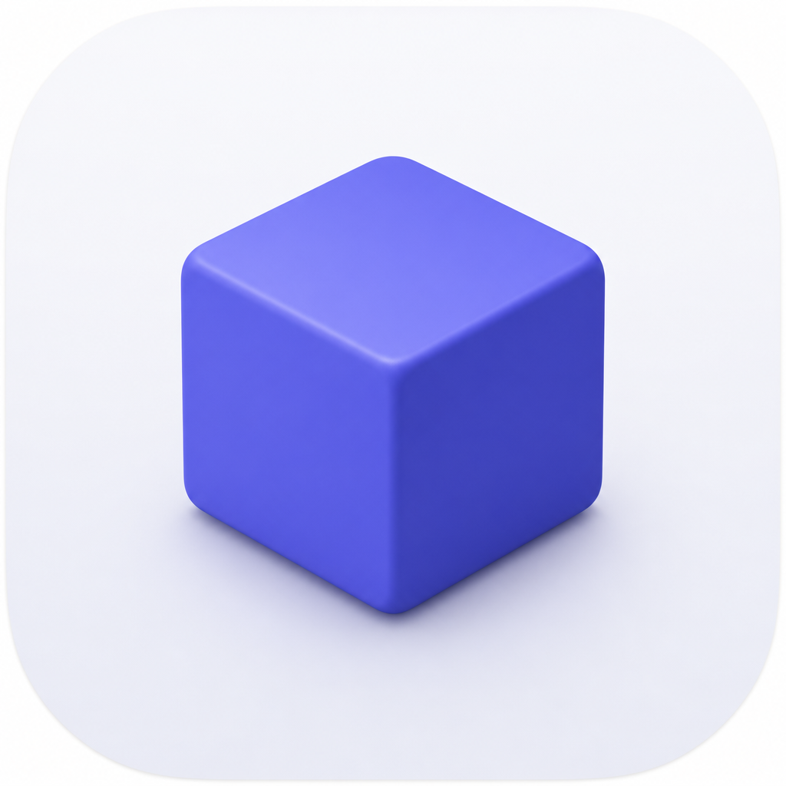

<p align="center">
  
</p>

<h1 align="center">RemotePair</h1>

<p align="center"><a href="README.md">English</a> · <b>한국어</b></p>

항상 켜져 있는 Mac에서 Claude Code를 실행하고, 완전한 macOS **Computer Use**(스크린샷·클릭·타이핑)까지 살린 채로, 노트북이나 폰에서 mosh/SSH로 붙는 도구입니다.


- **호스트 Mac** — `claude`를 영속 tmux 세션 안에서, Computer Use가 살아 있는 채로 24/7 돌립니다.
- **클라이언트 Mac** — Finder 우클릭 한 번으로 노트북에서 붙거나 뗍니다.
- **모바일** — 폰의 Claude Code에서 같은 세션에 들어갑니다.

---

## 빠른 시작 — Claude Code에게 설치 맡기기

이미 Claude Code가 있다면? **설정하려는 Mac에서** 세션을 열고 아래 블록을 붙여넣으면 — 역할 판단, 설치, SSH 연결, 유일한 수동 권한 단계 안내까지 전 과정을 알아서 진행해 줍니다.

```text
Set up RemotePair (https://github.com/ghyeongl/remote-pair) on this Mac. Fetch and read its README, then follow it. Figure out whether this Mac is the host or the client, explain each command before you run it, and stop for anything that needs my input or my physical screen (like the one-time permission grant). Finish with remote-pair doctor and a summary of what's left for me to do.
```

직접 하고 싶다면? 아래 [설치](#설치)를 참고하세요.

---

## 기능

각 기능은 구체적인 문제 하나를 해결합니다.

### 원격으로 가도 살아남는 Computer Use
**문제:** `claude`를 SSH로 띄우면 macOS가 손쉬운 사용(AX)·화면 기록(SR) 권한을 떼어버려, 스크린샷·클릭·타이핑이 조용히 멈춥니다.
**해결:** 권한을 쥔 메뉴바 앱(`RemotePairHost.app`)이 그 권한을 소유하고 `claude`를 자기 프로세스 하위 트리 안에 두기 때문에, 어떤 클라이언트가 붙어 있든 Computer Use가 계속 작동합니다.

### 연결이 끊겨도 살아남는 세션
**문제:** 노트북을 닫거나 Wi-Fi가 끊기면 오래 돌던 `claude` 세션이 연결과 함께 죽습니다.
**해결:** 패치된 tmux(`tmux-aqua`)가 모든 세션을 호스트에 살려둡니다. 언제든 다시 붙으세요 — 붙어 있으면 `Attached`, 떠나 있으면 `Detached`, 어느 쪽이든 세션은 24/7 돌아갑니다.

### 노트북에서도 폰에서도 붙기
**문제:** 늘 호스트 Mac 앞에 앉아 있는 건 아니죠.
**해결:** 클라이언트 Mac(Finder → 우클릭 → Launch Remote Pair)에서든 폰의 Claude Code에서든 붙습니다. 어디서 붙든 같은 세션, 같은 상태입니다.

### 대신 답해주는 권한 대화상자
**문제:** headless 호스트에서 "허용?" 같은 대화상자(또는 1Password 잠금 해제 프롬프트)가 세션을 막아 전체를 멈춰버립니다.
**해결:** on-demand approve 라우터(OCR + 클릭)가 올바른 버튼을 감지해 눌러줘서, headless 세션이 멈추지 않습니다.

---

## 요구 사항

- Apple Silicon Mac(호스트와 클라이언트)
- macOS Sequoia 이상 권장
- 클라이언트와 호스트 사이 SSH 키 인증
- 양쪽 모두 `mosh`(순수 SSH도 되지만, 연결이 끊기면 라이브 attach가 죽습니다)
- **호스트:** Homebrew(앱 cask용) + git. 빌드 안 함 — tmux-aqua는 앱에 임베드돼 있어 Xcode 불필요. (소스 빌드는 메인테이너만 해당)

---

## 설치

### 호스트 — 항상 켜져 있는 Mac

명령 하나로 호스트가 셋업됩니다. `remote-pair` CLI + approve 규칙·스킬(데몬 glue)을 깔고, 이어서 앱(`RemotePairHost.app`)을 Homebrew Cask로 설치합니다:

```bash
curl -fsSL https://raw.githubusercontent.com/ghyeongl/remote-pair/main/shared/bootstrap.sh | ROLE=host bash
```

첫 실행 시 앱이 **데몬**(LaunchAgent, `~/.remote-pair`, tmux-aqua 링크, watchdog)을 스스로 설치합니다. 앱은 self-signed이고 공증되지 않았지만, Homebrew가 quarantine 플래그를 떼어주므로 정상 실행되고 손쉬운 사용·화면 기록 권한도 안정적인 서명 정체성에 묶여 유지됩니다(TCC는 공증이 필요 없습니다 — quarantine만 없고 서명이 안정적이면 됨).

> Homebrew가 없다면? 스크립트가 알려주고 멈춥니다 — 설치([brew.sh](https://brew.sh)) 후 다시 실행하면 cask까지 알아서 깝니다. 앱 바이너리는 Homebrew가, 나머지는 스크립트가 담당합니다.

> 앱만 필요하고 CLI는 안 쓴다면? `brew tap ghyeongl/remote-pair https://github.com/ghyeongl/remote-pair && brew install --cask remote-pair-host`. (소스 빌드는 [메인테이너용](#메인테이너용) 참고.)

설치했으면 아래 **일회성 권한 부여**로 마무리하세요.

#### 일회성 권한 부여 — 물리적 화면 또는 VNC 필요

이건 유일한 수동 단계이고, 호스트 화면에서만 할 수 있습니다(SIP가 켜진 비-MDM Mac에서는 TCC를 SSH로 부여할 수 없습니다). **시스템 설정 → 개인정보 보호 및 보안**을 열고 `RemotePairHost`를 세 권한에 대해 ON 하세요(어떤 창에 목록이 없으면 `+`를 눌러 `/Applications/RemotePairHost.app`을 추가):

| 권한 | 이유 | 필요? |
|---|---|---|
| **손쉬운 사용(Accessibility)** | Computer Use를 위한 합성 입력(클릭/타이핑) | **필수** |
| **화면 기록(Screen Recording)** | Computer Use를 위한 스크린샷 | **필수** |
| **전체 디스크 접근(Full Disk Access)** | *headless* 호스트가 원격으로 답할 수 없는 macOS 폴더 프롬프트가 뜨는 것을 예방합니다(답하지 않은 프롬프트는 세션을 멈춤). trade-off: 이 권한을 실제로 쓰는 건 RemotePair 로직이 아니라 **그 안에서 띄운 Claude Code 세션**입니다(RemotePair 자체는 설치를 제외하면 디스크 접근을 쓰지 않음) — 그래서 그 세션이 디스크 전체(메일·메시지·브라우저 포함)를 조용히 읽을 수 있습니다. | **권장** |

앱 안의 **Grant Permissions…** 메뉴가 세 창을 모두 열고 각 항목의 실시간 ✓/✗ 상태를 보여줍니다. 켠 뒤 아래 명령으로 권한을 반영합니다:

```bash
launchctl kickstart -k gui/$(id -u)/com.x10lab.remote-pair-host   # 또는: 메뉴바 → Restart tmux host
```

> 전체 디스크 접근을 주기 싫다면? 프로젝트 폴더를 **보호되지 않은 루트**(예: `~/Desktop`/`~/Documents`/`~/Downloads`가 아닌 `~/Spaces`) 아래에 두세요 — 그러면 세션이 보호된 폴더에 닿지 않아 프롬프트가 뜨지 않으면서도, 디스크 전체를 열 필요가 없습니다.

### 클라이언트 — 직접 쓰는 노트북

#### SSH 접근 — 호스트에 키 기반 로그인

RemotePair는 호스트를 SSH로 제어하므로, 필요한 건 비밀번호 없는 로그인이 되는 상태뿐입니다. 확인:

```bash
ssh gh-mac-m1   # 프롬프트 없이 호스트 셸로 들어가면 성공
```

아직 안 된다면? 호스트에서 **원격 로그인**을 켜고(시스템 설정 → 일반 → 공유 — [Apple 가이드](https://support.apple.com/ko-kr/guide/mac-help/allow-a-remote-computer-to-access-your-mac-mchlp1066/mac)), 클라이언트에서 평범하게 키 인증을 설정하세요(키가 없으면 `ssh-keygen`, 그다음 `ssh-copy-id 계정@호스트`). 호스트에 `~/.ssh/config` 별칭을 `gh-mac-m1`처럼 짧게 달아두면 — 그 별칭이 나중에 `remote-pair config set host`에 넣는 값입니다.

> LAN 밖에서 호스트에 붙어야 하나요? **[Tailscale](https://tailscale.com)** 같은 메시 VPN이 어디서나 통하는 안정적인 이름을 호스트에 줍니다. `mosh`와 함께 쓰면 네트워크가 끊겨도 attach가 살아남습니다.

#### 클라이언트 설치

```bash
curl -fsSL https://raw.githubusercontent.com/ghyeongl/remote-pair/main/shared/bootstrap.sh | ROLE=client bash
```

Finder 빠른 동작 + `remote-pair` CLI를 설치하고, 이어서 `remote-pair onboard`(호스트 주소, 터미널 앱, 폴더 매핑)를 자동 실행합니다.

### 되돌릴 수 있는 제거

```bash
~/.local/share/remote-pair/shared/uninstall.sh          # 설치된 파일 제거(manifest 추적)
~/.local/share/remote-pair/shared/uninstall.sh --purge  # ~/.remote-pair 상태까지 제거
```

> Homebrew로 설치했다면 앱은 `brew uninstall --cask remote-pair-host`로 제거하세요(`--zap`을 붙이면 `~/.remote-pair`도 함께 정리).

---

## 폴더 매핑 (먼저 해야 함)

RemotePair는 `claude`를 **호스트에서**, **호스트의 파일**을 대상으로 실행합니다. 그래서 노트북에서 실행하는 프로젝트는 호스트에 이미 존재해야 합니다 — RemotePair는 파일을 복사하지 않고, 호스트 경로에 attach합니다. 양쪽 동기화는 **Google Drive, Syncthing, iCloud 등 파일 동기화 도구**로 직접 유지하고, 그러면 같은 프로젝트가 기기마다 (다를 수 있는) 절대 경로에 존재하게 됩니다.

**매핑**은 주어진 클라이언트 경로가 어떤 호스트 경로에 대응하는지 RemotePair에게 알려줍니다. 동기화 루트는 기기마다 부모 경로가 다르지만(`ghyeong` vs `rpi/Desktop`), **그 아래는 동일해야** 합니다 — RemotePair는 호스트의 같은 하위 폴더 구조에 attach합니다:

<p align="center">
  
</p>

```bash
remote-pair map add ~/Drive/proj /Users/me/proj   # 한 번 등록
remote-pair launch ~/Drive/proj                   # → 호스트의 /Users/me/proj에 attach
```

- **양쪽 경로가 같다면?** (예: `~/Spaces/proj`가 동일하게 존재) — 매핑 불필요, 실행 시 바로 해석됩니다.
- **경로가 다르다면?** 한 번 매핑을 등록하세요. 그 뒤로는 CLI와 Finder 빠른 동작 모두 자동으로 해석합니다.
- **매핑 안 됨 + 경로 다름?** `remote-pair launch`가 대화형 탐색을 돌립니다(호스트 경로 존재 확인 후 등록/생성/취소 제안). Finder GUI는 물어볼 수 없으므로 매핑이 미리 필요합니다.

> **작업 트리만** 동기화하고 `.git`은 제외하세요 — 활성 `.git`을 기기 간 동기화하면 저장소가 손상됩니다. 각 기기가 자기 `.git`을 두고, 소스 파일만 공유하세요.

---

## 사용법

```bash
# 경로가 다르면 폴더를 한 번 매핑(클라이언트 경로 → 호스트 경로)
remote-pair map add ~/Drive/proj /Users/me/proj

# 세션 실행 / attach
remote-pair launch ~/Drive/proj
remote-pair launch ~/Drive/proj --fresh   # 항상 새 세션
remote-pair launch ~/Drive/proj --yes     # 비대화형

# 또는: Finder → 폴더 우클릭 → 빠른 동작 → Launch Remote Pair
```

세션마다 유일한 상호작용은 claude 자체의 **"Allow for this session"** 프롬프트뿐 — Enter 한 번이면 됩니다.

### Finder에서 실행 (GUI) — 폴더 매핑 필요

폴더 우클릭 → **서비스 → "Launch Remote Claude"** 로 그 폴더의 호스트 세션에 붙습니다.

<p align="center">
  
</p>

**폴더가 먼저 매핑돼 있어야** 합니다(GUI는 호스트 경로를 대화형으로 물어볼 수 없음):
- **매핑됨**(`remote-pair map add`로 등록했거나, 클라이언트==호스트 동일 경로) → 바로 attach/생성.
- **매핑 안 됨** → GUI가 호스트 경로를 풀 수 없어 아무것도 하지 않습니다. 먼저 한 번 등록하세요:
  `remote-pair map add <폴더> <호스트경로>` 또는 `remote-pair launch <폴더>`(매핑 안 됐을 때 등록을 물음). 그 뒤로는 그 폴더에 대해 GUI가 작동합니다.

기타 명령:

```bash
remote-pair onboard          # 다시 실행 가능한 클라이언트 설정(호스트, 터미널, 매핑, doctor)
remote-pair open-gui <dir>   # 설정된 터미널 앱을 열고 새 탭/창에서 <dir> 실행
remote-pair ls               # 호스트 세션 + 폴더 매핑
remote-pair status           # 앱 PID, 호스트 서버, heartbeat 경과
remote-pair doctor           # SSH 인증, 호스트 앱, 호스트의 tmux-aqua 점검
remote-pair self-update      # 클라이언트(런처/CLI)를 GitHub 최신으로 업데이트 — 호스트와 동기화 유지
remote-pair config set host my-mac-mini
remote-pair config set terminal iterm2     # 또는: terminal
```

---

## Web UI (실험적)

`remote-pair web`을 실행하면 토큰으로 보호된 localhost 웹 브리지가 기동되며, 두 가지 역할을 함께 수행합니다:

1. **온보딩 마법사** — 역할 선택·권한 부여·SSH 점검·폴더 매핑·Syncthing 헬스·doctor 를 브라우저에서 라이브로 안내합니다.
2. **셸** — 온보딩 완료 후 같은 페이지가 터미널·Remote Desktop·에디터·알림 탭을 가진 상주 셸로 전환됩니다.

```bash
remote-pair web          # 브라우저에서 127.0.0.1:<port>?token=<run-token> 를 엽니다
```

브리지는 외부 의존이 없는 얇은 `python3` 어댑터(~150줄)로, 기존 `remote-pair` CLI에 shell-out하고 `status.json`을 읽을 뿐입니다. `.app`에 새 서버는 없습니다 — 앱은 기존처럼 1초마다 `status.json`을 갱신하고, 브라우저가 `/api/status`를 1.5초마다 폴링해 권한 변경이 앱 재시작 없이 ~2초 내에 반영됩니다.

### 알림 포워딩 (host → client)

**호스트**에 알림 훅을 설치하면 Claude Code의 Stop/Notification 이벤트가 클라이언트로 전달됩니다:

```bash
# 호스트에서 — bootstrap이 이미 설치; 필요 시 수동 재설치:
~/.local/share/remote-pair/host/hooks/manage-claude-hooks.py install
```

훅(`host/hooks/remote-pair-notify.sh`)이 이벤트를 `~/.remote-pair/notifications/queue.jsonl`에 기록합니다. 클라이언트 브리지가 SSH를 통해 이 파일을 폴링하고 알림 탭에 표시합니다. `~/.remote-pair/notify.conf`(`host/hooks/notify.conf.example` 참고)의 `ENABLED_TYPES`로 포워딩할 이벤트 종류를 선택할 수 있습니다.

### 에디터 탭 (code-server 필요)

에디터 탭은 `remote-pair-editor start`를 통해 `code-server`를 `127.0.0.1`에 바인딩해 기동합니다. `code-server`가 설치되어 있지 않으면 탭에 설치 안내 메시지가 표시됩니다.

```bash
remote-pair-editor start [<folder>]   # EDITOR_PORT(기본 8080)에서 code-server 시작
remote-pair-editor status             # 실행 중인지 확인
remote-pair-editor stop               # 중지
```

> **스캐폴드 주의:** 에디터 탭과 code-server 런처는 연결돼 있지만, 인-브라우저 에디터 레이아웃·Claude Code 익스텐션 통합은 아직 진행 중(스파이크)입니다. 거친 부분이 있을 수 있습니다.

### 정체성 안내

현재 출하 정체성은 **`RemotePairHost`** / `com.x10lab.remote-pair-host`입니다. `RemotePair` / `com.x10lab.remote-pair`로의 리네임(1회 TCC 재grant 필요)은 **v0.5.0**에 예정되어 있으며, 아직 적용되지 않았습니다. v0.5.0 이상을 명시적으로 설치하지 않았다면 `RemotePair.app`에 권한을 부여하지 마세요.

---

## 참고 및 주의

> ⚠️ **보안과 책임 — 반드시 읽으세요.** RemotePair는 의도적으로 호스트에서 macOS의 안전장치를 낮춥니다: 손쉬운 사용 + 화면 기록(그리고 켰다면 **전체 디스크 접근**)을 쥐고, 자율 `claude` 에이전트를 그 권한 있는 프로세스 하위 트리 *안에서* 24/7 원격 접근 가능한 상태로 돌립니다. 사실상 호스트의 에이전트가 화면을 보고, 클릭·키 입력을 합성하고, 전체 디스크 접근이 있으면 디스크 전체(메일, 메시지, 브라우저 데이터, SSH 키 전부)를 조용히 읽고 쓸 수 있습니다. (이 권한들을 실제로 행사하는 주체는 RemotePair 로직이 아니라 그 안에서 도는 `claude` 세션입니다 — RemotePair 자체는 설치를 제외하면 디스크를 건드리지 않습니다.) 그게 이 도구의 본질이며, 당신이 의도적으로 받아들이는 trade-off입니다. **호스트에서 무엇이 돌아가는지는 전적으로 당신 책임입니다.** 잘못된 설정, 부주의한 지시, 프롬프트 인젝션, 방치된 세션으로 인한 데이터 손실·유출·손상은 전적으로 운영자 책임입니다. 본인 소유의 개인 기기에서만 돌리고, 실제로 필요한 최소 권한만 부여하고(전체 디스크 접근보다 보호되지 않은 프로젝트 루트를 선호), 잃어선 안 되는 것에 연결하지 마세요. 소프트웨어는 **있는 그대로, 어떤 보증도 없이** 제공됩니다([LICENSE](LICENSE) 참고).

---

## 텔레메트리 — 기본 꺼짐, 동의 시에만

RemotePair는 **기본으로 켜진 텔레메트리가 없습니다.** 아래 두 보고 채널은 모두 **옵트인**입니다 —
당신이 명시적으로 켜기 전에는 완전히 침묵하며, 켜더라도 당신이나 당신의 작업을 식별할 수 있는 것은
절대 보내지 않습니다. 코드는 공개돼 있으니 직접 감사하세요.

**독립된 두 스위치, 둘 다 기본 꺼짐:**

| 스위치 | 하는 일 | 켰을 때 |
|---|---|---|
| 제품 분석 (`telemetry_consent` → PostHog) | 익명 활성화 퍼널 이벤트 — 셋업이 어디서 막히는지 파악 | 익명 이벤트 7종(예: "온보딩 시작", "호스트 연결", "첫 세션 시작")을 타이밍과 함께 전송 |
| 크래시 리포트 (`crash_report_consent` → Sentry) | 마스킹된 크래시/오류 리포트 업로드 | 크래시 시 마스킹된 스택 트레이스를 전송(로컬 크래시 덤프는 어느 쪽이든 항상 기록) |

둘은 서로 독립적이라 한쪽만 켤 수 있습니다. 첫 실행 시(체크 안 된 체크박스 2개) 선택하고, 이후
설정에서 각각 다시 토글할 수 있습니다.

**수집되는 것(옵트인했을 때만):** 익명 랜덤 설치 id(이 기기에서 한 번 생성되는 UUID — 어떤 계정과도
연결되지 않음), 앱 버전, OS 버전, CPU 아키텍처, 그리고 타이밍이 붙은 소수의 퍼널 이벤트. 실패는 원시
오류 텍스트가 아니라 고정된 사유 코드(`timeout`, `auth_denied`, `host_unreachable`, …)로 보고됩니다.

**절대 수집하지 않는 것:** 저장소 이름, 파일 경로, 명령 내용, IP 주소, 호스트명·ssh 별칭, 그 어떤
개인정보도 보내지 않습니다. 모든 페이로드는 기기를 떠나기 전 로컬 로그와 동일한 `redact()` 필터를
거치며, 크래시 리포트는 Apple/Sentry의 PII 수집을 끈 상태로 보냅니다.

**기본 꺼짐 = 네트워크 호출 0** — 두 스위치 모두 꺼져 있으면 RemotePair는 어떤 분석·크래시 엔드포인트에도
연결하지 않습니다. 현재 분석은 PostHog Cloud(EU 리전), 크래시 리포트는 Sentry로 향합니다. 엔드포인트는
설정 가능하며, 분석은 추후 자체 호스팅 인프라로 옮길 계획입니다. 전체 이벤트 카탈로그와 프라이버시
계약은 [docs/logging.md §11](docs/logging.md)을 참고하세요.

---

## 문제 해결 & 버그 신고

뭔가 안 되나요? 신고 전에 먼저 이걸 거쳐보세요:

1. **doctor 실행.** `remote-pair doctor`가 SSH 인증·호스트 앱·호스트의 tmux-aqua를 점검합니다 — 대부분의 설정 문제를 잡아주고 어느 쪽이 잘못됐는지 알려줍니다.
2. **status + 로그 확인.** `remote-pair status`는 앱 PID·호스트 서버·heartbeat 경과를 보여줍니다. 로그는 `~/.remote-pair/logs/`에 있습니다(`remote-pair.log`가 메인).
3. **`claude` 업데이트 후 Computer Use가 멈췄다면?** MCP 서버를 토글하세요: `/mcp disable computer-use` 후 `/mcp enable computer-use`. (TCC 재부여는 불필요.)
4. **권한은 켜진 것 같은데 Computer Use가 실패?** 권한을 다시 반영하세요: `launchctl kickstart -k gui/$(id -u)/com.x10lab.remote-pair-host`.

그래도 막히면 **[이슈를 열어주세요](https://github.com/ghyeongl/remote-pair/issues)**. 아래를 함께 넣어주세요:

- 버전(`remote-pair status` 또는 앱 메뉴바 **About**)과 macOS 버전.
- `remote-pair doctor` 출력과 `~/.remote-pair/logs/remote-pair.log`의 관련 부분.
- 기대한 동작 vs 실제 동작, 그리고 재현 단계.

> 비밀값은 붙여넣지 마세요 — 로그에서 SSH 호스트명·키·토큰을 지우고 첨부하세요.

---

## 메인테이너용

```bash
./host/build-tmux-aqua.sh              # 패치된 tmux → ~/.local/bin/tmux-aqua (tmux 3.6)
./host/make-signing-cert.sh            # 안정 self-signed cert "RemotePair Local Signing" (멱등)
./host/build-host.sh                   # → build/RemotePairHost.app (서명 + 검증)
./host/build-host.sh --deploy [host]   # 빌드 + rsync + 호스트에 설치
RP_VERSION=0.4.12 ./host/build-host.sh --release  # 서명, zip, gh 릴리스, cask bump
```

릴리스 자산은 실행 중인 설치와 **같은** 안정 cert로 서명돼야 합니다 — 인앱 업데이터가 leaf CN을 검증해 불일치 교체를 막습니다. 현재 버전: **0.4.12**(pre-1.0).

저장소 구조: `host/`(앱, 빌드 스크립트, approve 라우터, 스킬), `client/`(CLI, 런처, Finder 서비스), `shared/`(설치 라이브러리, 설정 SSOT, bootstrap), `Casks/`(Homebrew cask).

---

## 라이선스

AGPL-3.0-or-later. [LICENSE](LICENSE) 참고. (상용/dual 라이선스 문의 가능)

개인용 도구이며 macOS(Apple Silicon)에서 테스트되었습니다. Apple과 무관합니다. 기여 환영 — 큰 변경 전에는 이슈를 먼저 열어주세요.
