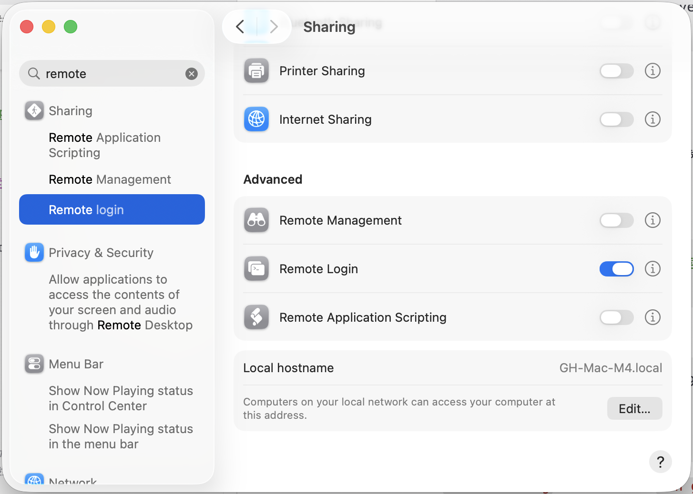
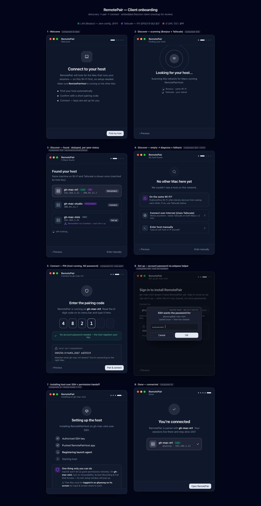

<p align="center">
  
</p>

<h1 align="center">Rasbora</h1>

<p align="center"><b>English</b> · <a href="README.ko.md">Korean</a></p>

<p align="center"><i>You close the laptop. The work doesn't stop.</i></p>

**Rasbora** runs the Claude you already subscribe to (or Codex / Gemini) on a **dedicated remote Mac**, with full macOS **computer-use** (screenshot, click, type) intact — unattended and fully visible — so your long tasks keep going while you're away. Attach from your laptop or your phone over mosh/SSH.

> **Naming:** *Rasbora* is the product brand. The shipping software still carries the **`RemotePair`** name — the host app (`RemotePairHost.app`), the client IDE (`RemotePair`), and the `remote-pair` CLI — and the repo lives at [`x10lab/xpair`](https://github.com/x10lab/xpair). A full rename to the Rasbora brand is in progress; the identifiers below are the ones that are real today.


- **Host Mac** — runs `claude` inside persistent tmux sessions, 24/7, with computer-use working.
- **Client** — the **Rasbora IDE** (a VSCodium fork) or the `remote-pair` CLI, attaching from your laptop with a Finder right-click.
- **Mobile** — reach the same sessions from Claude Code on your phone.

### Why Rasbora

1. **You keep your own computer.** The work runs on a dedicated (remote) Mac, so your laptop stays free — use it normally, close the lid, the session keeps running.
2. **It doesn't stall on approvals.** Auto-Approve clears the permission prompts that would otherwise block a headless, unattended session, so work continues while you sleep.
3. **It's not a black box.** Stream the remote desktop and watch every action. The engine is full-power **Claude Code** — your own subscription, no third-party wrapper in the middle.

**Billing:** connect the Claude / Codex / Gemini subscription you already pay for. Rasbora charges **zero** extra AI credits. The core is open source (AGPL-3.0); a managed **Hosted** tier (we provide the Mac too) is planned.

---

## Quick start — let Claude Code install it

Already have Claude Code? Paste the block below into a session **on the Mac you're setting up** and it drives the whole install end-to-end — figuring out the role, installing, wiring SSH, and walking you through the one manual permission step.

```text
Set up Rasbora / RemotePair (https://github.com/x10lab/xpair) on this Mac. Fetch and read its README, then follow it. Figure out whether this Mac is the host or the client, explain each command before you run it, and stop for anything that needs my input or my physical screen (like the one-time permission grant). Finish with remote-pair doctor and a summary of what's left for me to do.
```

Prefer to do it by hand? See [Installation](#installation) below.

---

## Features

Each feature exists to solve a concrete problem. The **core** below works today; a few surfaces are still **in progress** and are marked as such.

### Computer-use that survives going remote
**Problem:** Run `claude` over SSH and macOS strips its Accessibility (AX) and Screen Recording (SR) grants — so screenshot/click/type silently stop working.
**Solution:** A privileged menu-bar app (`RemotePairHost.app`) owns the grants and keeps `claude` inside its process subtree, so computer-use keeps working no matter which client is attached. Your Claude operates apps and the browser like a person — no dashboard to learn, just tell it what you want.

### A dedicated remote Mac — keep using your own computer
**Problem:** To drive a computer, an agent needs one. If it borrows yours, you're locked out — no mouse, no screen, no work.
**Solution:** Everything runs on a Mac of its own. Your laptop stays free, and nothing stops when you close the lid. Check in from desktop or phone whenever you want.

### Sessions that survive disconnects
**Problem:** Close the laptop or drop Wi-Fi and your long-running `claude` session dies with the connection.
**Solution:** A patched tmux (`tmux-aqua`) keeps every session alive on the host. Reattach anytime — `Attached` while you're there, `Detached` while you're gone, sessions running 24/7 either way.

### It works while you sleep — approvals answered for you
**Problem:** A blocking "Allow?" dialog (or a 1Password unlock prompt) on a headless, unattended host stalls the whole session — and no one is there to say yes.
**Solution:** An on-demand approve router (OCR + click, with a Claude fallback classifier) detects the dialog and clicks the right button, so headless sessions don't hang and the work runs all night.

### Start with one right-click
**Problem:** You're not sitting at the host Mac, and you want a session scoped to a specific project folder.
**Solution:** Right-click a folder (Finder → Quick Actions → *Launch Remote Pair*) and a session starts there, attached to that folder's host path. Run one per folder, manage them all in one place.

### Your desk, in your pocket
**Problem:** You leave your desk but the work shouldn't.
**Solution:** Reach the same sessions from **Claude Code on your phone** — it attaches over SSH/mosh to the very tmux session running on the host. No separate app to install; the work keeps moving while control stays in your hands.

### In progress
These are wired up but still maturing (scaffold / spike) — expect rough edges:

- **The Rasbora IDE** (VSCodium fork): the *Sessions* sidebar and *Browser* container ship; the embedded extension bundling, in-IDE **Remote Desktop** streaming, and **code-server Editor** are still being wired in. See [The Rasbora IDE](#the-rasbora-ide-the-client).
- **Live remote-desktop streaming**: today `remote-pair desktop` opens macOS Screen Sharing (VNC); a low-latency in-house engine (`host/rd`, JPEG → WebRTC) is at the spike stage.
- **Electron onboarding windows** (host + client) are being rebuilt from scratch — see [Onboarding](#onboarding-in-progress).
- **Hosted tier** (we provide the remote Mac for you) is planned.

---

## Requirements

- Apple Silicon Mac (host and client)
- macOS Sequoia or later recommended
- SSH key authentication between client and host
- `mosh` on both machines (plain SSH works, but a disconnect kills the live attach)
- **Host:** Homebrew (for the app cask) + git. No build — tmux-aqua ships embedded in the app, so no Xcode needed. (Source build is maintainers-only.)
- **Client:** either the Rasbora IDE cask (`remote-pair`) or just the `remote-pair` CLI + Finder Quick Action.

---

## Installation

### Host — the always-on Mac

One command sets up the host. It installs the `remote-pair` CLI + the approve rules/skill (the daemon glue), then installs the app (`RemotePairHost.app`) via Homebrew Cask:

```bash
curl -fsSL https://raw.githubusercontent.com/x10lab/xpair/main/shared/bootstrap.sh | ROLE=host bash
```

On first launch the app self-installs its **daemon** (LaunchAgent, `~/.remote-pair`, tmux-aqua link, watchdog). The app is self-signed, not notarized — Homebrew strips the quarantine flag so it launches normally *and* its Accessibility / Screen Recording grants stick to the stable signing identity (TCC needs no notarization, only a quarantine-free, stably-signed app).

> No Homebrew? The script tells you and stops — install it ([brew.sh](https://brew.sh)) and re-run; it'll handle the cask. Homebrew supplies the app binary; the script does the rest.

> Just want the app, no CLI? `brew tap x10lab/xpair https://github.com/x10lab/xpair && brew install --cask remote-pair-host`. (Building from source instead is in [For maintainers](#for-maintainers).)

Once installed, finish with the **one-time permission grant** below.

#### One-time permission grant — needs a physical screen or VNC

This is the one manual step, and it can only be done at the host's screen (TCC cannot be granted over SSH on SIP-enabled, non-MDM Macs). Open **System Settings → Privacy & Security** and turn `RemotePairHost` ON for three grants (if it isn't listed in a pane, click `+` and add `/Applications/RemotePairHost.app`):

| Grant | Why | Needed? |
|---|---|---|
| **Accessibility** | Synthetic input (click/type) for computer-use | **Required** |
| **Screen Recording** | Screenshots for computer-use | **Required** |
| **Full Disk Access** | Prevents macOS folder prompts that a *headless* host can't answer remotely (an unanswered prompt stalls the session). Trade-off: the grant is exercised not by Rasbora's own logic but by the **Claude Code session running inside it** (Rasbora itself touches the disk only at install) — so that session can silently read the whole disk (Mail/Messages/browser included). | **Recommended** |

The in-app **Grant Permissions…** menu item opens all three panes and shows live ✓/✗ status for each. After toggling, pick up the grants with:

```bash
launchctl kickstart -k gui/$(id -u)/com.x10lab.remote-pair-host   # or: menu bar → Restart tmux host
```

> Prefer not to grant Full Disk Access? Keep your project folders under a **non-protected root** (e.g. `~/Spaces`, not `~/Desktop`/`~/Documents`/`~/Downloads`) — then sessions never hit a protected folder and never prompt, without opening the whole disk.

### Client — the laptop you sit at

You can run the client as the **Rasbora IDE** (a VSCodium-based app with a Sessions sidebar) or as the **CLI + Finder Quick Action** — they share the same `remote-pair` config and host.

#### SSH access — key-based login to the host

Rasbora drives the host over SSH, so all you need is passwordless login working. Check it:

```bash
ssh gh-mac-m1   # logs into the host shell with no password prompt → you're set
```

Not there yet? Turn on **Remote Login** on the host (System Settings → General → Sharing — [Apple's how-to](https://support.apple.com/guide/mac-help/allow-a-remote-computer-to-access-your-mac-mchlp1066/mac)), then set up key auth from the client the usual way (`ssh-keygen` if you have no key, then `ssh-copy-id user@host`). Give the host a short `~/.ssh/config` alias like `gh-mac-m1` — that alias is the value you pass to `remote-pair config set host` later.

<p align="center">
  
</p>

> Reaching the host from outside your LAN? A mesh VPN like **[Tailscale](https://tailscale.com)** gives the host a stable name that works anywhere. Pair with `mosh` so the attach survives network drops.

#### Install the client

**Rasbora IDE (cask):**

```bash
brew tap x10lab/xpair https://github.com/x10lab/xpair && brew install --cask remote-pair
```

**CLI + Finder Quick Action (no IDE):**

```bash
curl -fsSL https://raw.githubusercontent.com/x10lab/xpair/main/shared/bootstrap.sh | ROLE=client bash
```

The CLI install adds the Finder Quick Action + `remote-pair` CLI, then auto-runs `remote-pair onboard` (host address, terminal app, folder mappings).

### Reversible uninstall

```bash
~/.local/share/remote-pair/shared/uninstall.sh          # remove installed files (manifest-tracked)
~/.local/share/remote-pair/shared/uninstall.sh --purge  # also remove ~/.remote-pair state
```

> Installed via Homebrew? Remove the app with `brew uninstall --cask remote-pair-host` (or `remote-pair` for the IDE); add `--zap` to also clear `~/.remote-pair`.

---

## Folder mapping (do this first)

Rasbora runs `claude` **on the host**, against files **on the host**. So the project you launch from your laptop has to already exist on the host — Rasbora doesn't copy files, it attaches to a host path. You keep both sides in sync yourself with **Google Drive, Syncthing, iCloud, or any file-sync tool** (or mount the host folder directly with `remote-pair mount` — see [docs/m-mount.md](docs/m-mount.md)); the same project then lives at a (possibly different) absolute path on each machine.

A **mapping** tells Rasbora which host path a given client path corresponds to. The sync root sits at a different parent path on each machine (`ghyeong` vs `rpi/Desktop`), but **everything below it must be identical** — Rasbora attaches to the same subfolder structure on the host:

<p align="center">
  
</p>

```bash
remote-pair map add ~/Drive/proj /Users/me/proj   # register once
remote-pair launch ~/Drive/proj                   # → attaches to /Users/me/proj on the host
```

- **Same path on both machines?** (e.g. `~/Spaces/proj` exists identically) — no mapping needed; launch resolves it directly.
- **Different paths?** Register the mapping once. After that, both the CLI and the Finder Quick Action resolve it automatically.
- **Not mapped + different paths?** `remote-pair launch` runs an interactive probe (checks whether the host path exists, offers to register / create / cancel). The Finder GUI can't prompt, so it needs the mapping up front.

> Sync only the **working tree**, not `.git` — syncing a live `.git` across machines corrupts the repo. Each machine keeps its own `.git`; share source files only.

---

## Usage

```bash
# Map a folder once (client path → host path), if they differ
remote-pair map add ~/Drive/proj /Users/me/proj

# Launch / attach a session
remote-pair launch ~/Drive/proj
remote-pair launch ~/Drive/proj --fresh   # always a new session
remote-pair launch ~/Drive/proj --yes     # non-interactive

# Or: Finder → right-click the folder → Quick Actions → Launch Remote Pair
```

The only per-session interaction is claude's own **"Allow for this session"** prompt — press Enter once.

### Launch from Finder (GUI) — requires a folder mapping

Right-click a folder → **Services → "Launch Remote Claude"** to attach that folder's host session.

<p align="center">
  
</p>

**The folder must be mapped** first (the GUI can't prompt you for the host path interactively):
- **Mapped** (registered via `remote-pair map add`, or client==host same path) → attaches/creates directly.
- **Not mapped** → the GUI can't resolve the host path and does nothing. Register it once first:
  `remote-pair map add <folder> <host-path>` or `remote-pair launch <folder>` (prompts to register when unmapped). After that the GUI works for that folder.

### All commands

```bash
remote-pair launch <dir>     # launch / attach a session for a folder (prompts to register if unmapped)
remote-pair ls               # host sessions + folder mappings
remote-pair map add|rm|list  # client path ↔ host path mappings
remote-pair onboard          # re-runnable client setup (host, terminal, mappings, doctor)
remote-pair open-gui <dir>   # open the configured terminal app and launch <dir> in a new tab/window
remote-pair status           # app PID, host server, heartbeat age
remote-pair doctor           # check SSH auth, host app, tmux-aqua on host
remote-pair desktop open     # open the host screen via macOS Screen Sharing (vnc://) — see In progress
remote-pair editor start     # start the code-server editor on loopback (default :8080) — scaffold
remote-pair mount            # mount a host folder directly (Syncthing alternative; smb/sshfs) — docs/m-mount.md
remote-pair logs [--host -f] # tail launcher/app logs (--host = host logs over SSH)
remote-pair self-update      # update the client (launcher/CLI) to latest from GitHub
remote-pair update           # hot-swap the glue layer (CLI/approve/hooks) without touching the .app (M6 L1)
remote-pair config set host my-mac-mini
remote-pair config set terminal iterm2     # or: terminal
```

---

## The Rasbora IDE (the client)

The client ships as a **VSCodium fork** (`remote-pair` cask) — a familiar editor reshaped around remote pairing. It is the successor to the old browser-based "Web UI" (a `remote-pair web` localhost bridge), which has been **removed**. What it adds on top of stock VSCodium:

- **Sessions sidebar** — a single fixed sidebar listing your host sessions (Attached / Detached), with a session picker. This is the home base of the IDE.
- **Browser container** — a folder/Search/Extensions container with per-folder favorites (hover star + `+`), replacing the stock Explorer chrome.
- **Remote Desktop panel** *(in progress)* — view and drive the host screen from inside the IDE (v1 JPEG, v2 WebRTC). Today the streaming engine (`host/rd`) is a spike; `remote-pair desktop open` falls back to macOS Screen Sharing (VNC).
- **Editor (code-server)** *(scaffold)* — `remote-pair-editor` runs code-server on loopback; the in-IDE tab and Claude Code extension wiring are WIP.

The IDE keeps stock VSCodium **inviolable**: RemotePair changes live only in `client/ide/remotepair/` (one frontend patch + an embedded extension + a product overlay), so upstream VSCodium pulls stay conflict-free. See [`client/ide/remotepair/REMOTEPAIR.md`](client/ide/remotepair/REMOTEPAIR.md).

### Onboarding *(in progress)*

First-run onboarding is being rebuilt from scratch as **two Electron windows** — one embedded in `RemotePairHost` (the host app) and one in the Rasbora IDE (the client) — covering role selection, permission grants, SSH/host config, and folder mapping. The earlier web wizard was retired; the new windows are not finished yet.

<p align="center">
  
</p>

### Notification forwarding (host → client)

Install the notify hook on the **host** to forward Claude Code Stop/Notification events to the client:

```bash
# on the host — the bootstrap already does this; manual re-install if needed:
~/.local/share/remote-pair/host/hooks/manage-claude-hooks.py install
```

The hook (`host/hooks/remote-pair-notify.sh`) appends events to `~/.remote-pair/notifications/queue.jsonl`. The client polls this file over SSH (`remote-pair notify`) and surfaces alerts. Edit `~/.remote-pair/notify.conf` (see `host/hooks/notify.conf.example`) to choose which event types to forward (`ENABLED_TYPES`, default `notification,stop`).

### Identity note

Today's shipping identities are **`RemotePairHost`** (`com.x10lab.remote-pair-host`, the host app) and **`RemotePair`** (`com.x10lab.remote-pair`, the client IDE). The *Rasbora* product brand is being rolled out across these; the identifiers above are what's real now. Do not grant permissions to an app whose identity you didn't explicitly install.

---

## Notes & caveats

> ⚠️ **Security & responsibility — read this.** Rasbora intentionally lowers macOS's safety guardrails on the host: it holds Accessibility + Screen Recording (and, if you enable it, **Full Disk Access**) and keeps an autonomous `claude` agent running *inside* that privileged process subtree, reachable remotely 24/7. In effect, an agent on the host can see the screen, synthesize clicks/keystrokes, and — with Full Disk Access — silently read and write your entire disk (Mail, Messages, browser data, SSH keys, everything). (What actually exercises these grants is the `claude` session running inside Rasbora, not Rasbora's own logic — Rasbora itself never touches the disk except at install.) That is the whole point of the tool, and it is a deliberate trade-off you are opting into. **You are solely responsible for what runs on the host.** Any data loss, leakage, or damage caused by misconfiguration, a careless instruction, a prompt-injection, or an unattended session is entirely the operator's responsibility. Run this only on a personal machine you own, grant the minimum permissions you actually need (prefer a non-protected project root over Full Disk Access), and don't point it at anything you can't afford to lose. The software is provided **as-is, without warranty** (see [LICENSE](LICENSE)).

---

## Telemetry — opt-in, off by default

Rasbora ships **no telemetry that is on by default**. Both reporting channels below are
**opt-in** — they stay completely silent unless you explicitly turn them on, and even then they
never carry anything that could identify you or your work. The code is open; audit it yourself.

**Two independent switches, both default OFF:**

| Switch | What it does | When ON |
|---|---|---|
| Product analytics (`telemetry_consent` → PostHog) | anonymous activation-funnel events, so we can see where setup breaks | sends 7 anonymous events (e.g. "onboarding started", "host connected", "first session started") with timing |
| Crash reports (`crash_report_consent` → Sentry) | uploads scrubbed crash/error reports | sends a redacted stack trace when something crashes (local crash dumps are written either way) |

Each can be on without the other. You choose at first run (two unchecked checkboxes) and can flip
either later in settings.

**What is collected (only when you opt in):** an anonymous random install id (a UUID generated
once on this machine — not tied to any account), app version, OS version, CPU architecture, and a
small set of funnel events with timings. Failures are reported as a fixed set of reason codes
(`timeout`, `auth_denied`, `host_unreachable`, …), never raw error text.

**What is NEVER collected:** repository names, file paths, command contents, IP addresses, your
hostnames or ssh aliases, or any personal data. Every payload is run through the same `redact()`
filter used for local logs before it leaves the machine, and crash reports have Apple/Sentry PII
collection disabled.

**Default OFF means zero network calls** — with both switches off, Rasbora makes no connection
to any analytics or crash endpoint. Analytics currently routes to PostHog Cloud (EU region);
crash reports to Sentry. The endpoint is configurable and we plan to move analytics to self-hosted
infrastructure later. See [docs/logging.md §11](docs/logging.md) for the full event catalog and
privacy contract.

---

## Troubleshooting & reporting bugs

Hit something broken? Work through this before filing:

1. **Run the doctor.** `remote-pair doctor` checks SSH auth, the host app, and tmux-aqua on the host — it catches most setup problems and tells you which side is wrong.
2. **Check status + logs.** `remote-pair status` shows the app PID, host server, and heartbeat age. Logs live at `~/.remote-pair/logs/` (`remote-pair.log` is the main one).
3. **Computer-use stopped after a `claude` update?** Toggle the MCP server: `/mcp disable computer-use` then `/mcp enable computer-use`. (No need to re-grant TCC.)
4. **Permissions look granted but computer-use fails?** Re-pick up the grants: `launchctl kickstart -k gui/$(id -u)/com.x10lab.remote-pair-host`.

Still stuck? **[Open an issue](https://github.com/x10lab/xpair/issues)** and include:

- Version (`remote-pair status`, or the app's menu-bar **About**) and your macOS version.
- `remote-pair doctor` output, and the relevant tail of `~/.remote-pair/logs/remote-pair.log`.
- What you expected vs. what happened, and the exact steps to reproduce.

> Please don't paste secrets — scrub SSH hostnames, keys, and tokens from logs before attaching.

---

## For maintainers

This is a single **monorepo** (`host/` + `client/` + `shared/`), built in lockstep:

```bash
./host/build-tmux-aqua.sh              # patched tmux → ~/.local/bin/tmux-aqua (tmux 3.6)
./host/make-signing-cert.sh            # stable self-signed cert "RemotePair Local Signing" (idempotent)
./host/build-host.sh                   # → build/RemotePairHost.app (signed + verified)
./host/build-host.sh --deploy [host]   # build + rsync + install on host
./client/ide/build.sh                  # → the Rasbora IDE (VSCodium fork) app
shared/identity/check-identity.sh      # brand/version consistency (SoT: shared/identity/)
```

Versions are declared once in `shared/identity/versions.json` (host **0.5.0**, ide / screen-engine **0.1.0**) and verified across consumers (casks, product.json, Cargo, Config.swift). Release assets **must** be signed with the same stable cert as the running install — the in-app Updater verifies the leaf CN and blocks a mismatched swap. Releases (host app + IDE) are cut together via `.github/workflows/release.yml`.

Repo layout (see [docs/monorepo-structure.md](docs/monorepo-structure.md)):

- `host/` — `app/` (the menu-bar Swift app), `rd/` (in-house remote-desktop engine: `screen/` Rust + `rpmedia/` Swift), `hooks/`, `skills/`, approve router, build glue.
- `client/` — `cli/` (the `remote-pair*` scripts + Finder service) and `ide/` (VSCodium fork: `remotepair/` = our code, `vendor/vscodium/` = pristine upstream subtree).
- `shared/` — install lib, config SSOT, `identity/` and `screen-protocol/` single-source-of-truth, bootstrap.
- `docs/`, `tests/`, `assets/`, `Casks/`.

---

## License

AGPL-3.0-or-later. See [LICENSE](LICENSE). (Commercial/dual licensing inquiries welcome)

Personal tool, tested on macOS (Apple Silicon). Not endorsed by Apple. Contributions welcome — please open an issue before large changes.
