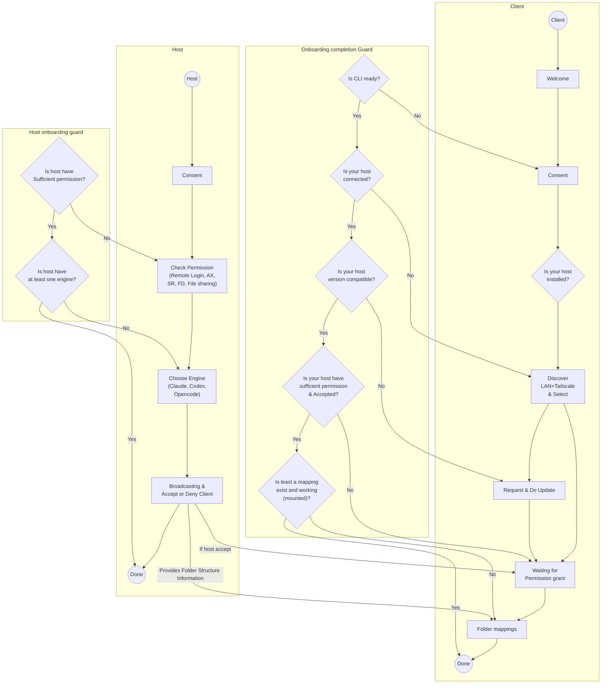

# Onboarding flow (client + host)

Redesigned onboarding flow for the client (IDE webview) and host (macOS app),
including the client-side "Onboarding completion Guard" and the host-side
"Host onboarding guard". Rendered from the Excalidraw design.

Guard convention: vertical edges between decision diamonds are the **Yes** path;
horizontal edges to an action node are the **No** (repair) path — each failed
gate drops to its matching repair step, then re-probes.

